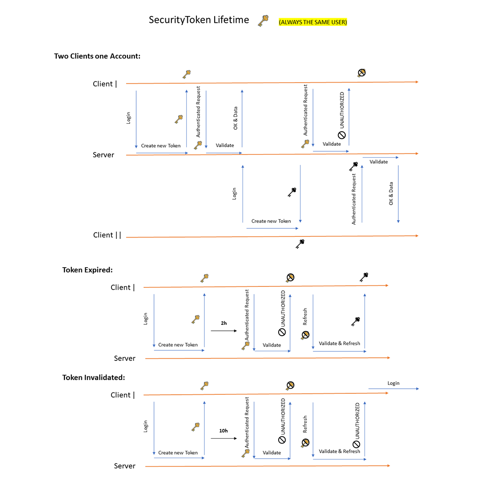
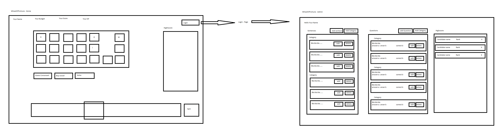

# WheelOfFortune
Dies ist ein Schulprojekt. Es geht darum eine Webseite zu implementieren. Die Technologien können frei gewählt werden. Ich habe mich für PostgreSQL, Spring & AngularJS entschieden. 

# Authentifizierungssystem (Portfolio)
[Zum Portfolio im BBBaden Portfolio Portal](https://portfolio.bbbaden.ch/view/view.php?t=zZ1MC89kgLcxA3dUQTyK) **(Hier ist besser 💯)**

## Rollen
Mein Authentifizierungssystem funktioniert einfach mit einer User Rolle. Also man hat nicht die möglichkeit zu sagen, User a kann auf Seite X & Y zugreifen und User b nur auf die Seite Y. Man kann aber abfragen ob ein Client eingelogt ist oder nicht. So kann man auch einfache Restriktionen machen für Clients die nicht eingelogt sind. 

## Aufbau
Das ganze funktioniert mit einem einzigen SecurityToken. Wenn sich ein Client anmeldet, wird ihm einen neuen Token geschickt.<br/>
Falls ein anderer Client schon mit diesem Benutzer angemeldet ist wird sein Token invalid.<br/>
Immer wenn eine Aktion authentifiziert sein muss, wird ein valider Token im Request-Header erwartet.<br/>
Falls ein Token abläuft, hat ein Client eine gewisse Zeitspanne Zeit ihn zu refresehen. Wenn ein Token refreshed worden ist, wird ein neuer dem Client gesendet und der alte invalid. Wird ein Token nicht rechtzeitig refreshed, wird er auch invalid und der Client muss sich neu anmelden.



## Backend
Das Backend besteht aus verschiedenen typen. <br/>
Es ist geschrieben in Java & Spring. 
- Controller
- Service
- Repository
- Data Access Object
- Data Transfer Object
- Exception
- Advice

### Controller
Der Controller ist die öffentliche API-Schnittstelle zum Web. Er kann mit normalen HTTP-Requests angesprochen werden. Wichtig hier ist, dass einem wirklich bewusst ist, dass alles im Controller öffentlich zugänglich ist und deshalb authentifiziert werden muss.<br/>
Zu jedem Controller gehört ein Service. Und der Controller macht wirklich nichts anderes als requests entgegen nehmen, sie an seinem Service weitergeben und eine response schicken. 

### Service
Ein Service sollte immer ein stateless bean sein, welches unteranderem vom Controller angesprochen wird und Aufgaben löst.<br/> 
Der Service ist dieser Teil im Programm welcher umhergegeben wird. Also wenn ein GameService plötzlich, aus irgeneinem Grund, etwas am User ändern muss, dann importiert er nicht das UserRepo sondern importiert den UserService und nimmt über ihn dann die Änderungen vor. So kann im UserService die Änderung validiert werden.

### Repsoitory
Das Repository ist die Anbindung zur Datenbank. Spring leistet hier sehr viel Hilfe. Sie haben ihre eigene implementierung von JPA umgesetzt und relativ viel generisch zur verfügung gestellt. <br/>
Ein Repository gehört immer zu einem Service und sollte auch nur von diesem gebraucht werden. 

**Gebrauch von Spring Data JPA:**
- Konfigurieren der Datenbankanbindung im `application.properties`.
- Entity mit JPA-Annotations erstellen
- Repo erstellen -> Interface welches CRUDRepository extendet. Das CRUDRepo ist generisch und verlangt die Entity und deren Typ der Id (Primary Key). 

Falls einem die Methoden im CRUDRepo nicht ausreichen kann man im eigenen Repo-Interface weitere Methoden definieren. Für diese wird dann von Spring dynamisch ein SQL-Script generiert. 

```java
public interface UserRepo extends CRUDRepository<User, Long> {
    Optional<User> findUserByUsername(String username);
}
```

Mann kann auch Methoden mit eigenem Query schreiben. 

```java
public interface UserRepo extends CRUDRepository<User, Long> {
    @Query(
        value = "SELECT * FROM User AS u WHERE u.username = '?1'" //?1 references the first parameter (String username)
    )
    Optional<User> findUserByUsername(String username);
}
```

### Data Access Object (DAO)
Das ist eine Java Klasse welche nur Daten beinhaltet und mit den JPA-Annotations annotiert ist. Sie wird gebraucht als Schnittstelle zwischen der Datenbank und Java. Wenn mann in Java etwas (mit Spring Data JPA) in einer Datenbank speichern will übergibt man ein solches Objekt einem Repository. Auf diese Klasse habe ich vorhin mit Entity verwiesen.

### Data Transfer Object (DTO)
Das sind diese Java Klassen die der Controller entgegen nimmt wenn er Daten erwartet oder die er in der Response sendet. Also wenn der Controller mit einem User im Body antworten will sendet er eine Http Response mit einem UserDTO zum Client. Das DTO wird von Spring via Jackson in einen JSON String gewandelt. 

### Exception
In Spring ist es good practice eigene Exceptions zu gebrauchen. Also wenn man einen User nach Username sucht und ein lehres Optional bekommt, ist es am besten einfach eine UserNotFountException zu werfen. 
Weil durch die Advices von Spring kann man diese extrem gut handeln. 

### Advice
Advices sind Methoden in einem AdviceBean die warten bis eine Exception geworfen wird. Also jeder Advice ist mit einer spezifischen Exception konfiguriert. Sobald ihre Exception geworfen wird, werden sie aufgerufen. <br/>
Von einem Advice wird immer einen String als return Wert erwartet. Das ist normalerweise die Fehlermeldung.

Ein Advice wird durch Annotationen konfiguriert: 
- @ResponseBody - definiert, dass der return Wert im Body des HTTP-Responses sein soll.
- @ResponseStatus - der HTTP-Status welcher die HTTP-Response haben soll. 
- @ExceptionHandler(""ExceptionName"".class) - Die Exception welche den Advice triggern soll.

Die Klasse in denen mann die Advice-Methoden schreibt wird mit "@ConrollerAdvice" annotiert. 

**Beispiel:** <br/>
Fängt die UserNotFoundException & Spring generiert und sendet eine HttpResponse mit dem Status NOT_FOUND und dem Body `User 1 (oder was auch immer als exception message definiert worden ist) not found`
```java
@ControllerAdvice
public class UserAdvice {
    @ResponseBody
    @ResonseStatus(HttpStatus.UNAUTHORIZED)
    @ExceptionHandler(UserNotFoundException.class)
    public String userNotFound(UserNotFoundException e){
        return "User " + e.getMessage() + " not found"; 
    }
}
```
 
## Frontend
Das Frontend ist einfach ein simples Angular Projekt mit vier Seiten. 
- Home 
- Login
- Admin  
- Error

Um die Admin Seite anzuschauen muss mann eingeloggt sein. Dies ist mit einem Angular Guard umgesetzt.

Die Error Seite sollte man eigendlich nie sehen. Sie zeigt einfach unerwartete Fehler an. 

Auch das Frontend besteht aus verschiedenen Typen. 
 - Component
 - Service
 - Guard
 - Interceptor

 ### Component
 Ein Component ist ein kleiner Teil einer Webseite, wie zum Beispiel ein Button. Jeder Component besteht normalerweise aus einem Html file, einem CSS file und einem TypeScript file. 
 Das Html file und das TypeScript file stehen in enger Verbindung. Mann kann zum Beispiel Daten aus dem ts. file im Html anzeigen oder vom Html Funktionen im ts. file aufrufen. Das ts. file vom Component wird nie von einem anderen Service oder so direkt angesprochen. Der Component aber imporitiert Services um seine Arbeit zu erledigen.

 ### Service
 Ein Service in Angular ist relativ ähndlich wie ein Service in Spring. Er ist verantwortlich für das ausführen einer gewissen Arbeit. Dieser sollte normaler weise auch Stateless aufgebaut sein, weil Daten im Frontend relativ schnell verlohren gehen können. Zum Beispiel wenn die Seite neu geladen wird. Ein Service kann aber verantwortlich sein für das Speichern verschiedener Daten im LocalStorage oder so. 

 ### Guard 
 Ein Guard ist die Art wie man in Angular eine Rout vor unerlaubtem Zugriff schützt. Also wenn man nicht eingeloggt ist aber den Link einer Seite eingibt, für die man eingeloggt sein muss, dann springt der Guard dazwischen und leitet einem, zum Beispiel zur Login Seite, weiter. Ein Guard ist auch eine ts Klasse welche einfach als Guard konfiguriert wurde. Das heisst, was ein Guard macht ist 100% frei programmierbar.

 ### Interceptor
 Ein Interceptor ist auch eine ts Klasse welche vor jedem HTTP-Request ausgeführt wird. So kann man konfigurationen an einem Request automatisch vornehmen. Ich habe dies zum Beispiel gebraucht um, falls vorhanden, das "auth" Feld mit dem SecurityToken am Header des Requests anzuhängen.  

<br><br>

# LB Aufgaben
## Aufgabe 2
### Tier 1 Presentation
Mein Presentations Tier ist sehr dynamisch. Je nach Spielstand wird komplett etwas anderes angezeigt. Das HTML wird dynamisch generiert.
### Tier 2 Webserver
Mein Webserver Tier ist auch einigermaßen dynamisch. Mann kann selber wählen welchen Webserver man verwenden möchte um das Frontend zu hosten. Der Webserver muss einfach NodeJS und Angular Routes unterstützen. 
### Tier 3 Application Server
Mein Application Server ist überhaupt nicht dynamisch. Das Framework welches ich verwende hat einen selbst eingebauten Application Server. Diesen kann man nicht so einfach austauschen. Und auch die allgemeine API ist relativ hardcoded und muss von hand erweitert oder verändert werden.
### Tier 4 Data-Server 
Mein Data-Server kann auch relativ dynamisch ausgetauscht werden. Man muss einfach die neue Connection Daten im `backend/src/main/resources/application.properties` eintragen.

## Aufgabe 3
### Tier 1 Presentation
Für die Presentation habe ich das Framework Angular gebraucht. Für die Webseite an sich habe ich normales HTML 5 verwendet. Als styling Sprache habe ich SCSS verwendet. Und als script Sprache habe ich TypeScript verwendet.  
### Tier 2 Webserver
NodeJS dient als mein webserver. Diesen habe ich aber fast nicht angefasst, weil ich nichts daran konfigurieren musste. 
### Tier 3 Application Server
Mein Application Server ist eine Java Spring Applikation. Spring selber verwendet einen grossen Teil von Tomcat, hat aber selber darauf noch recht viel aufgebaut.
### Tier 4 Data-Server 
Als Data Server habe ich jetzt PostgreSQL verwendet. Da aber Spring Data JPA recht flexibel ist, kann dieser auch recht schnell durch einen anderen SQL Data Server ersetzt werden.

## Aufgabe 4
Ich steure meine Daten via Spring Data JPA. Das ist ein ORM von Spring basierend auf der JPA. 

Spring Data JPA funktioniert mit herkömmlichen Java Entities welche mit JPA Annotations verziert wurden. Die Verknüpfung zur Datenbank funktioniert aber über ein Java Interface. Dieses wird als Repository bezeichnet. Die Implementation für das Repository wird von Spring bei Build-Time generiert. 

## Aufgabe 5
Hier ist mein Wireframe: (Erstellt am Dienstag 15 März 2022) 


## Aufgabe 8
### Anforderungsanalyse

**Anforderungsnummer**: 1 <br>
**Typ / Kategorie**: Funktionale Anforderung <br>
**Beschreibung**: Administratoren müssen sich durch Username und Passwort authentifizieren.

**Anforderungsnummer**: 2 <br>
**Typ / Kategorie**: Funktionale Anforderung <br>
**Beschreibung**:  Administratoren können einzelne Einträge der Highscoreliste löschen.

**Anforderungsnummer**: 3 <br>
**Typ / Kategorie**: Funktionale Anforderung <br>
**Beschreibung**:  Der Kandidat oder die Kandidatin müssen einen Namen eingeben können, der auf der Highscoreliste erscheint.

**Anforderungsnummer**: 4 <br>
**Typ / Kategorie**: Funktionale Anforderung <br>
**Beschreibung**:  Die Anzahl der Spielrunden soll gezählt werden.

**Anforderungsnummer**: 5 <br>
**Typ / Kategorie**: Nicht-Funktionale Anforderung <br>
**Beschreibung**:  Einfache Formulareingaben, wie leere Textfelder etc., sollen auf Client- und Serverseite geprüft werden.

### Testfallspezifikation

**Anforderungsnummer**: 1 <br>
**Testfallnummer**: 1.1 <br>
**Voraussetzungen**: Die Webseite ist auf der /home route geöffnet. <br>
**1. Eingabe**: Oben rechts auf den Login Knopf drücken.<br>
**1. Ausgabe**: Login-Seite erscheint<br>
**2. Eingabe**: Username und Passwort eingeben ("Admin", "Adm1nUser")<br>
**2. Ausgabe**: Admin-Seite erscheint<br>

**Anforderungsnummer**: 2 <br>
**Testfallnummer**: 2.1 <br>
**Voraussetzungen**: Der Admin ist eingeloggt, ist auf der Admin Route & es gibt ein Paar HighScore Einträge <br>
**1. Eingabe**: Zum zu löschenden HighScore Eintrag hin scrollen<br>
**2. Eingabe**: Auf der rechten Seite des HighScore Eintrags den Abfalleimer drücken<br>
**1. Ausgabe**: Eine Nachricht erscheint zuunterst auf dem Bildschirm<br>
**2. Ausgabe**: Die HighScore List lädt neu & und der Eintrag ist weg<br>

**Anforderungsnummer**: 3 <br>
**Testfallnummer**: 3.1 <br>
**Voraussetzungen**: Route home ist offen, kein Spiel wurde gestartet <br>
**1. Eingabe**: Benutzername und gewünschte Kategorie angeben.<br>
**2. Eingabe**: Das Spiel durchspielen (Spielen und einmal Beenden).<br>
**3. Eingabe**: Die Seite neu laden<br>
**1. Ausgabe**: Der eingegebene Benutzername erscheint auf der HighScore list. (Ausser das Spiel war das schlechteste und es sind schon 9999 Einträge in der List)<br>

**Anforderungsnummer**: 4 <br>
**Testfallnummer**: 4.1 <br>
**Voraussetzungen**: Die Webseite ist offen und ein Spiel wurde gerade beendet. <br>
**1. Ausgabe**: In der Statistiken Liste wird die Anzahl gespielte Runden angezeigt. <br>

**Anforderungsnummer**: 5 <br>
**Testfallnummer**: 5.1 <br>
**Voraussetzungen**: Der Webserver und der App-Server sind gestartet & die Admin-Route ist offen. <br>
**1. Eingabe**: Ein neuer Satz erstellen, mit dem Satz: "Dies ist ein ;;; Invalider Satz" <br>
**1. Ausgabe**: Satz Feld wird rot und speichern Knopf kann nicht gedrückt werden. <br>
**2. Eingabe**: Ein POST request an den API Endpunkt "/game/data/sentence" mit dem Satz: "Dies ist ein ;;; Invalider Satz" senden <br>
**2. Ausgabe**: "{ error: EntityInvalidException -> ... }" <br>

### Testprotokoll
| Testfall Nummer | Test Nummer | OK / NOK | Bemerkungen | Tester       | Datum      | Unterschrift |
|-----------------|-------------|----------|-------------|--------------|------------|--------------|
| 1.1             | 1           | `OK `    | /           | M. Schweizer | 05.04.2022 | `M. Sch`     | 
| 2.1             | 1           | `OK `    | /           | M. Schweizer | 05.04.2022 | `M. Sch`     | 
| 3.1             | 1           | `OK`     | /           | M. Schweizer | 05.04.2022 | `M. Sch`     | 
| 4.1             | 1           | `OK`     | /           | M. Schweizer | 05.04.2022 | `M. Sch`     | 
| 5.1             | 1           | `OK `    | /           | M. Schweizer | 05.04.2022 | `M. Sch`     | 

### Testbericht

Guten Tag Herr Projektabnehmer

Ich habe Ihre Applikation nach den vorgegebenen Testfällen getestet. Dabei konnte ich keine Fehler finden, die entsprechenden Resultate des Testes entnehmen Sie dem Testprotokoll. So empfehle ich Ihnen, gemäss Planung im Projekt fortzufahren. <br>
Ich freue mich über eine Rückmeldung.

Mit Freundliche Grüssen<br>
Micha Schweizer
